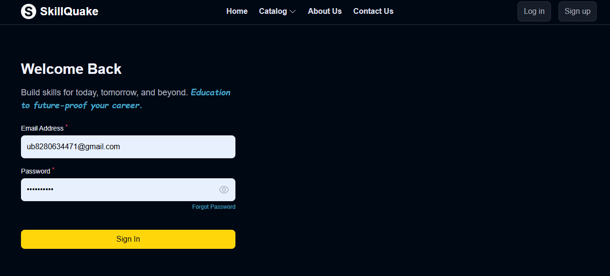

# Skillquake

## Description
Empower Your Future with Coding Skills
With our online coding courses, you can learn at your own pace, from anywhere in the world, and get access to a wealth of resources, including hands-on projects, quizzes, and personalized feedback from instructors.

## How to Run Locally
1. Clone the repository: `git clone https://github.com/uday-biswas/skillQuake-main.git`
2. Open the terminal inside the main folder and run these commands to install dependencies:
```
npm install
cd frontend
npm install
cd ../backend
npm install 
cd ..
```
3. Create a `.env` file inside the frontend folder and define the backend url:
```
REACT_APP_BASE_URL=http://localhost:4000/api/v1
```
4. Then create a `.env` file inside the backend folder and define the following:
```
PORT_BACKEND=4000
FRONTEND_URL='http://localhost:3000'

DATABASE_URL= YOUR_MONGODB_URL

JWT_SECRET= RANDOM_SECRET_STRING
jWT_EXPIRES_IN = RANDOM_NUMBER (example: "1d")
JWT_COOKIE_EXPIRES_IN= RANDOM_NUMBER (example : 3)

CLOUD_NAME= YOUR_CLOUDINARY_CLOUD_NAME
CLOUD_API_KEY= YOUR_CLOUDINARY_API_KEY
CLOUD_API_SECRET= YOUR_CLOUDINARY_API_SECRET

MAIL_HOST='smtp.gmail.com'
MAIL_USER= YOUR_MAIL_ID
MAIL_PASSWORD= YOUR_MAIL_PASSWORD

RAZORPAY_KEY = YOUR_RAZORPAY_KEY
RAZORPAY_SECRET = YOUR_RAZORPAY_SECRET

```
4. Start the frontend as well as backend with a single command : 
```
npm run app
```

## or

   firstly, start the backend with the following commands: 
```
cd backend
npm run server
```
   and open another terminal and start the frontend with the following commands : 
```
cd frontend
npm start
```
5. Open your browser and navigate to `http://localhost:3000`

## Landing Page:


## Features
- **Sign Up page:** Users can create a new account by providing their name, email, and password.


- **Log In page:** Existing users can log in using their email and password.



## Technologies Used
- React.js for the frontend
- Node.js and Express.js for the backend
- MongoDB for the database
- JWT (JSON Web Tokens) for authentication
- Nodemailer for sending emails

## Deployment

- The frontend is deployed in vercel. [Link](https://skill-quake.vercel.app/) :point_left:
- The backend is deployed in render. [Link](https://skillquake-main-backend.onrender.com) :point_left:

## Getting Started
- Follow the live demo links above and enjoy the site.

### Prerequisites

- A modern browser, up to date.  :muscle:

## Author

👤 Uday Biswas
- Github: [@UdayBiswas](https://github.com/uday-biswas) 
- Linkedin: [@UdayBiswas](https://www.linkedin.com/in/udaybiswas944/)  

## Show your support

Give a ⭐️ if you like this project!
